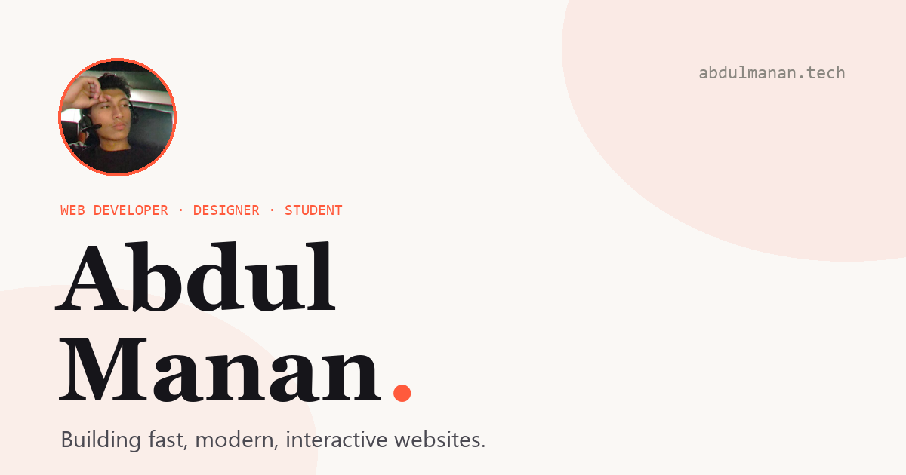

<div align="center">

# Abdul Manan — Portfolio

**Web Developer · Designer · Student**

A fast, interactive, SEO-optimized personal site that fills itself from GitHub.
Projects, stats and blog posts update automatically — no build step, no CMS.

🌐 **[abdulmanan.tech](https://abdulmanan.tech)** &nbsp;·&nbsp; [GitHub](https://github.com/abdulmanan69) · [LinkedIn](https://www.linkedin.com/in/abdulxmanan) · [Instagram](https://www.instagram.com/abdul_x_manan)




</div>

---

## ✨ Features

- **Clean, minimal design** — warm paper palette, one coral accent, serif display type
- **Mouse-interactive** — custom trailing cursor, magnetic buttons, 3D tilt cards, cursor-follow hero blob, scroll reveals, animated counters
- **Dark / light theme** — respects system preference, remembers your choice
- **Loading intro** animation
- **Live GitHub projects** — top repos pulled straight from the API (stars, forks, language)
- **Native language chart** + contribution graph, streak and live stat counters
- **GitHub-driven blog** — every post is a markdown file in [`posts/`](posts); push one and it appears, credited to Abdul Manan, with its own SEO metadata
- **SEO-first** — per-page titles/descriptions, `Person` + `BlogPosting` structured data, Open Graph & Twitter cards, `sitemap.xml`, `robots.txt`, canonical URLs
- **Fully responsive** and accessible (reduced-motion aware)

## 🧱 Tech

Plain **HTML + CSS + JavaScript**. No framework, no bundler. Markdown rendered client-side with [`marked`](https://marked.js.org). That's the whole stack.

## 📁 Structure

```
portfolio/
├── index.html            # page + SEO meta + structured data
├── style.css             # design system, themes, responsive rules
├── script.js             # interactions + GitHub/blog engine
├── posts/                # ← blog: one .md file per post
│   ├── *.md
│   └── images/           # post cover images
├── og-image.png          # social share preview
├── favicon.svg  robots.txt  sitemap.xml  site.webmanifest
├── CNAME  .nojekyll       # custom domain + GitHub Pages
└── SAMPLE-POST.md         # template for new posts
```

## ✍️ Writing a blog post

1. Add a `.md` file to [`posts/`](posts) (copy [`SAMPLE-POST.md`](SAMPLE-POST.md)).
2. Fill in the front-matter, then write in markdown:
   ```yaml
   ---
   title: My Post
   date: 2026-07-24
   excerpt: One line for the card and SEO.
   cover: posts/images/my-post.png
   tags: web, design
   ---
   ```
3. Commit. The site picks it up automatically — no redeploy.

> Want covers like these? The generator lives in the repo history; any 1200×675 image works.

## 🚀 Deploy

**Netlify** — drag the folder onto [netlify.com/drop](https://app.netlify.com/drop), add the custom domain, done. Contact form works via Netlify Forms.

**GitHub Pages** — Settings → Pages → deploy from `main` / root. `CNAME` and `.nojekyll` are already included. On Pages, swap the contact form for [Formspree](https://formspree.io).

**Domain (Cloudflare):** point `A @` to GitHub's IPs (`185.199.108–111.153`) as **DNS-only** during setup, set SSL/TLS to **Full**, then Enforce HTTPS on GitHub.

## 🔧 Make it yours

Everything configurable sits at the top of [`script.js`](script.js):

```js
const GH_USER = "abdulmanan69";               // projects + stats
const BLOG = { user, repo, path, branch };    // where posts live
```

---

<div align="center">
Built &amp; designed by <strong>Abdul Manan</strong> · <a href="https://abdulmanan.tech">abdulmanan.tech</a>
</div>
